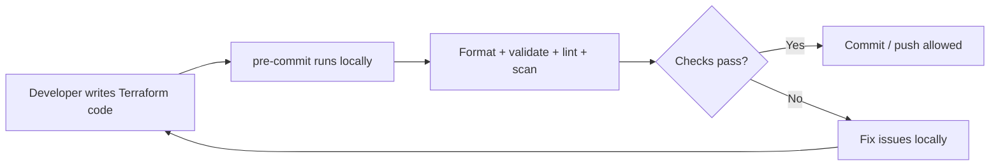

# Terraform Pre-commit Hooks

A practical and lightweight pre-commit setup for Terraform projects used by infrastructure and DevOps teams.

This repository is meant to be a clean example you can reuse in real Terraform repositories. It helps enforce formatting, validation, linting, security scanning, and team conventions before code is committed or pushed.

## Why this setup?

Terraform code benefits from early checks because small mistakes can become expensive infrastructure issues.

This example helps with:

- Terraform formatting consistency
- syntax validation
- linting and best-practice enforcement
- secret detection
- security scanning for IaC
- conventional commit messages
- branch naming rules

## Example workflow



## Included checks

This example combines a few standard tools:

- pre-commit-hooks for generic hygiene
- gitleaks for secret scanning
- pre-commit-terraform for Terraform-specific checks
- tflint for Terraform linting
- checkov for infrastructure security and compliance checks
- local hooks for commit message and branch naming

## Quick start

1. Install pre-commit:

```bash
pip install pre-commit
```

2. Install the hooks:

```bash
pre-commit install --install-hooks
```

3. Run all hooks manually:

```bash
pre-commit run --all-files
```

4. Run on staged files only:

```bash
pre-commit run
```

## Example configuration

See `.pre-commit-config.yaml` in this repository for the working example.

```yaml
default_install_hook_types: [pre-commit, commit-msg, pre-push]
default_stages: [pre-commit]
minimum_pre_commit_version: "4.0.0"

repos:
  - repo: https://github.com/pre-commit/pre-commit-hooks
    rev: v6.0.0
    hooks:
      - id: trailing-whitespace
      - id: end-of-file-fixer
      - id: mixed-line-ending
        args: [--fix=lf]
      - id: check-yaml
      - id: check-merge-conflict
      - id: detect-private-key

  - repo: https://github.com/gitleaks/gitleaks
    rev: v8.30.1
    hooks:
      - id: gitleaks

  - repo: https://github.com/antonbabenko/pre-commit-terraform
    rev: v1.109.1
    hooks:
      - id: terraform_fmt
        args:
          - --hook-config=--tool-version=1.16.4
      - id: terraform_validate
        args:
          - --hook-config=--tool-version=1.16.4
          - --hook-config=--retry-once-with-cleanup=true
          - --tf-init-args=-backend=false
      - id: terraform_tflint
        args:
          - --hook-config=--tool-version=0.64.0
          - --args=--config=__GIT_WORKING_DIR__/.tflint.hcl
      - id: terraform_checkov
        args:
          - --args=--config-file=__GIT_WORKING_DIR__/.checkov.yaml
```

## TFLint example

The repository includes a sample `.tflint.hcl` tuned for Terraform work.

```hcl
config {
  call_module_type = "local"
}

plugin "terraform" {
  enabled = true
  preset  = "recommended"
}

plugin "azurerm" {
  enabled = true
  version = "0.32.0"
  source  = "github.com/terraform-linters/tflint-ruleset-azurerm"
}

rule "terraform_documented_variables" {
  enabled = true
}

rule "terraform_documented_outputs" {
  enabled = true
}

rule "terraform_naming_convention" {
  enabled = true
}

rule "terraform_standard_module_structure" {
  enabled = true
}
```

## Checkov example

The repository includes a sample `.checkov.yaml` for Terraform scanning.

```yaml
framework:
  - terraform
compact: true
quiet: true
download-external-modules: false
```

## Notes

This is intentionally simple and practical. It is designed to be used as:

- a baseline repository quality gate
- a team starter template
- a local validation layer before CI

It does not replace CI/CD validation; it complements it by catching issues earlier, before a push or merge.

## Recommended usage

For team repositories, this kind of setup is especially useful when:

- multiple engineers contribute to the same Terraform codebase
- modules are shared across environments
- security review is required before deployment
- standard naming and formatting are important

## License

This project is provided as an example for infrastructure and DevOps teams.
